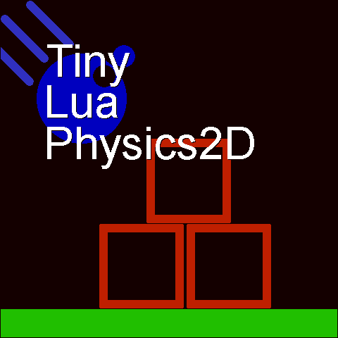

# TinyLuaPhysics2D v0.1

> [!WARNING] 
> Note: This library is incomplete yet.

## Intro

This is a tiny 2D physics engine purely written in Lua, providing a straightforward 2D physics simulation system for constrained development environments.

- Contains only a single file with no external dependencies, making it easy to integrate into existing projects.
- Can run in most sandboxed or restricted environments.
- Developed based on LuaJIT, but theoretically compatible with other versions: Lua 5.1, Lua 5.2, Lua 5.3, Lua 5.4, and Luau.

> [!WARNING] 
> Note: If you need to simulate hundreds of polygons, please use LuaJIT. The standard Lua interpreter can easily become a performance bottleneck in computationally intensive scenarios, and enabling JIT can improve performance by up to 3 times.

## Todo

### v1.0

- [ ] *feature* Support polygon shape & predef polygon shape.
- [ ] *feature* Add world serializer.
- [ ] Add examples.

### Future (If possible)

- [ ] *perf* Dynamic-AABB-Tree for static type bodies.
- [ ] *perf* Spatial-Hash-Map for dynamic type bodies.
- [ ] *stability* Sleep dynamic type bodies.
- [ ] *feature* Add more constraints: Joints.
